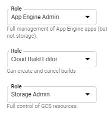
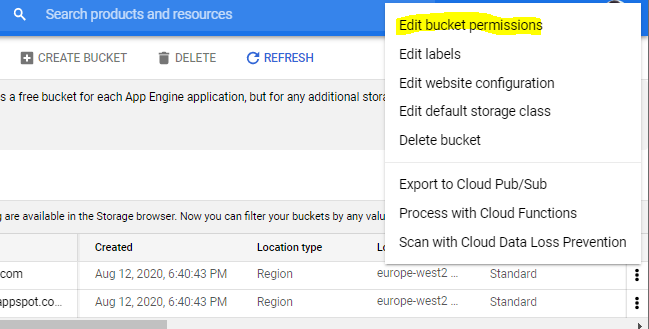
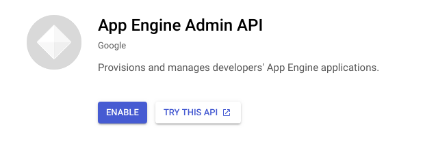

# Deployments

You can deploy Edge on Vercel by just adding the environment variables needed, but you will need a paid plan. 

In this document we explain how to deploy this solution on Google Cloud Platform. 

## Github Actions
We are using two different actions to deploy Edge in two different environments (development and production) by using [Etereo GAE action](https://github.com/etereo-io/deploy-gae-action). Please see the `dev.yml` and `pro.yml` to see what those actions do in more detail

The application is deployed in Google App Engine instances.

## Steps

To deploy your site with all the functionalities you need to follow the next steps:

1. Create accounts for all the environment variables needed
   1. Ex: sendgrid for mailing, mongodb, etc
2. Create a .env file following the example of `.env.build` file
3. Configure Google Cloud
   1. Create a service account for the deployments
   2. Create the App engine application
   3. Enable build APIs 
   4. Create the buckets for the storage
4. Configure Github Secrets
5. Push to your github repository


# NextJS + GAE CICD

## INTRO

**Google App Engine** allows you to create scalable applications hosted in a serverless platform.

Thanks to Github Actions, we can deploy our applicaton whenever a specific event occurs in our repository.

This is a sketch of the interaction between the two:

[](./images/diagram.png)

**How are we goint to deploy?**

- **A COMMIT IN MASTER BRANCH WILL DEPLOY THE DEVELOPMENT VERSION (service app-dev)**
- **A NEW TAG WILL DEPLOY THE PRODUCTION VERSION (service default)**

## SETUP GOOGLE CLOUD

### Create and configure a service account

Visit [https://console.cloud.google.com/iam-admin/serviceaccounts/create](https://console.cloud.google.com/iam-admin/serviceaccounts/create)

I Create a new Service Account

II Grant the following roles:

- App Engine Admin
- Cloud Build Editor




III Generate key (JSON)


Generate a JSON file with the key for this service account. **YOU WILL NEED THIS FILE TO STORE THE VALUES AS GITHUB SECRETS.**

- Now, encode this JSON (the contents) as a base64 and set it in your github secrets section as `GCP_SA_KEY`
- Then, get the 


**Create an application in App Engine**

Visit [https://console.cloud.google.com/appengine](https://console.cloud.google.com/appengine) and create an application.


### Configure Storage buckets

Visit [https://console.cloud.google.com/storage/browser](https://console.cloud.google.com/storage/browser)



I Edit bucket permissions and add your service account as a member of these buckets:

- staging.PROJECT-ID.appspot.com
- REGION.artifacts.PROJECT-ID.appspot.com (Create bucket with this name, if you don’t have one)

with the roles **Storage Object Creator** and **Storage Object Viewer**.

### Enable APIs

- Go to [https://console.cloud.google.com/](https://console.cloud.google.com/) and search “App Engine Admin API”. Hit “ENABLE” button and the API will be enabled in a few seconds.



- Search “Cloud Resource Manager API” and enable this API too.
- Search "Cloud Build API" and enable this API too.

### Enable Billing

## SETUP GITHUB ACTIONS AND SECRETS

Github Actions reads the workflows for your application from **project_folder/.github/workflows**. Each workflow defines which events trigger its execution.


We will define two workflows to be executed by the Github runners:
1- **Production** (on push a new tag)

```jsx
on:
  push:
    tags:
      - v*
```

2- **Staging** (on push commit to master)

```jsx
on:
  push:
    branches:
      - master
```

### Github Actions

Now, let’s see how to invoke the **gcloud app deploy** command from within Github Actions. I will go through all the steps of the yaml file, you can find the link to the example repo **here**. (TODO)

These will be the steps:

```jsx
- name: Checkout
        uses: actions/checkout@v1
```

We checkout the current contents of the repo.

```jsx
- name: Setup node
        uses: actions/setup-node@v1
        with:
          node-version: 12.x
      - run: node generate-vars.js "${{ secrets.ENV_VARIABLES }}"
```

We download/cache the node version 12.x. Then, we execute the generate-vars.js script, passing the ENV_VARIABLES secret as argument (this secret comes from the CICD). This script will generate a `.env` file with all the environment variables needed by the project.

```jsx
- name: Initialize Google Cloud SDK && Deploy
        uses: etereo-io/deploy-gae-action@master
        with:
          gae_config_path: './app-dev.yaml'
          service_account: ${{ secrets.GCP_SA_KEY }}
          project_id: ${{ secrets.PROJECT_ID }}
```

We use Google Cloud SDK commands to authenticate with the service account and deploy the application to GAE

### Github Secrets

We have two types of secrets: 

- secrets with values needed for deploying in GAE (GCP_SA_KEY and PROJECT_ID). **THEY COME FROM THE JSON FILE GENERATED WHEN YOU CREATE THE SERVICE ACCOUNT.**
- secrets with values consumed in the app's code (ENV_VARIABLES and ENV_VARIABLES_PRO).

GCP_SA_KEY (service account’s key json file, encoded as base64 string **$cat project-id.json | base64**)

PROJECT_ID (project’s id google cloud platform)

ENV_VARIABLES/ENV_VARIABLES_PRO: This is an base64 encoded version of the environment variables that are used inside the application.


## Other files related to the deployment process

**project/app-pro.yaml**

```jsx
runtime: nodejs12
instance_class: F2

service: default
```

**project/app-dev.yaml**

```jsx
runtime: nodejs12
instance_class: F2

service: app-dev
```


**NOTE: THE FIRST SERVICE DEPLOYED MUST BE "default"**

**project/.gcloudignore**

```jsx
.gcloudignore

.git

.gitignore

node_modules
```
